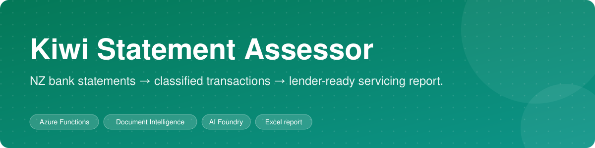
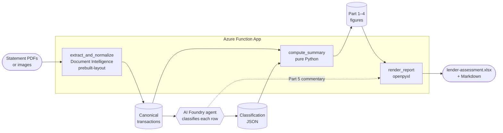
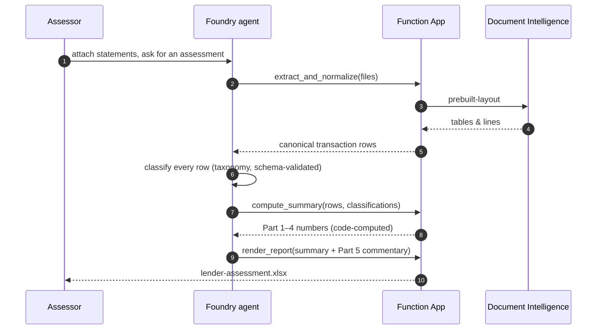

<div align="center">



# kiwi-knowledge-bill-ocr

**Turn New Zealand bank statements into a lender-ready servicing assessment.**
OCR the statements, let a model *classify* every transaction, let *code* compute every total, and get back an Excel / Markdown report an underwriter can sign off.


[How it works](#how-it-works) · [Design rule](#the-one-design-rule) · [API](#http-api) · [Deploy](#deploy) · [Tests](#tests)

</div>

---

## The problem

Mortgage and credit servicing in New Zealand means reading months of bank statements and answering: *what does this household really spend each month, what do they earn, and what do they already owe?* Doing it by hand is slow. Asking an LLM to do it end to end is worse — models are good at recognising "this is a power bill", and bad at adding up 400 transactions the same way twice.

This project splits the job along that line.

## The one design rule

> **The model classifies. It never computes totals.**

| Lives in **code** (deterministic, tested) | Lives in the **agent prompt** (judgement) |
|---|---|
| Parsing statements into canonical rows | Which category a transaction belongs to |
| Exclusions (internal transfers, card / loan / mortgage repayments, interest, redraws, reimbursements) | Whether a line is one-off or recurring |
| Frequency detection & monthly equivalents | Applicant-specific context |
| Account-conduct flags per statement account | Part 5 assessor commentary |
| Every figure in Parts 1–4 of the report | — and it may not introduce new numbers |

Every number an underwriter reads was produced by Python and covered by a test. The model's output is JSON labels, validated against a schema.

## How it works





## The report

The output follows a lender expense-pack layout ([`templates/lender-assessment.md`](templates/lender-assessment.md)):

| Section | Contents |
|---|---|
| **1. Applicant profile** | Applicant details, linked-account inventory, document index and account-conduct summary |
| **1.4 Income verification** | Credits and binder income — placed before expenses so servicing has a numerator |
| **Part 1** | Applicant expense summary — monthly-equivalent totals per category |
| **Part 2** | Regular expenses — categorised line items with frequency assessment and calculation tables |
| **Part 3** | One-off expenses |
| **Part 4** | Existing liabilities |
| **Part 5** | Assessor commentary — model-written, may not introduce numbers absent from Parts 1–4 |

### Taxonomy

Exactly **15 living-expense categories** tuned for NZ servicing, not household budgeting ([`schemas/taxonomy.md`](schemas/taxonomy.md)):

Transport · Utilities · Insurance · Food, Grocery, Clothing & Personal Care · Recreation & Entertainment · Monthly Subscriptions · Education · KiwiSaver & Savings / Investments · Childcare & Child Support · Donations / Tithings · Rent / Board Paid · Medical · Extracurricular · Other · One-Off

with insurance and utility sub-types, explicit exclusions (never counted as living expenses), and council rates flagged for the underwriter rather than guessed.

## HTTP API

Three routes on the Function App (`host.json` route prefix `api`), described for the agent by one OpenAPI spec, [`foundry/openapi-servicing.json`](foundry/openapi-servicing.json):

| Route | Does |
|---|---|
| `POST /api/extract_and_normalize` | Document Intelligence `prebuilt-layout` → canonical transaction rows ([schema](schemas/canonical-transaction.schema.json)) |
| `POST /api/compute_summary` | Exclusions, frequency detection, monthly equivalents, conduct counts, Part 1 / 3 / 4 figures |
| `POST /api/render_report` | Fills the lender-assessment template and returns the `.xlsx` |

## Repository layout

| Path | What it is |
|---|---|
| `function_app/` | Azure Functions app (Python v2 model) — the deployed HTTP tools |
| `foundry/` | AI Foundry agent instructions, prompts, and the OpenAPI spec used to attach the tools ([how to attach them](foundry/HOW_TO_HANG_TOOLS.md)) |
| `pipeline/` | Test harness for the function modules, plus the extract/normalise design note |
| `schemas/` | Canonical transaction + classification JSON Schemas, and the expense taxonomy |
| `templates/` | Report template and the Excel builder (`build_excel.py`) |
| `fixtures/` | Synthetic statement generator + notes on public NZ statement layouts |
| `specs/` | The original assessment specification |

## Deploy

1. Create an **Azure Function App** (Python 3.11+) in the same region as your AI Foundry project, and an **Azure AI Document Intelligence** resource. Grant the Function App access to it (key or managed identity with *Cognitive Services User*).
2. Publish the functions:

   ```bash
   cd function_app
   func azure functionapp publish <your-function-app-name>
   ```

3. Set app settings — Document Intelligence endpoint/key, storage connection, and the container allow-list — in the Function App configuration. Nothing secret is committed.
4. In **AI Foundry**, create an agent, paste [`foundry/PASTE-THIS-INTO-FOUNDRY-AGENT-INSTRUCTIONS.txt`](foundry/PASTE-THIS-INTO-FOUNDRY-AGENT-INSTRUCTIONS.txt) into its instructions, and attach the OpenAPI tool from `foundry/openapi-servicing.json`. Step-by-step: [`foundry/HOW_TO_HANG_TOOLS.md`](foundry/HOW_TO_HANG_TOOLS.md).

## Tests

```bash
python3 pipeline/test_compute_summary.py
python3 pipeline/test_extract_normalize.py
python3 pipeline/test_render_report.py
python3 pipeline/test_openapi_spec.py
```

Each `pipeline/test_*.py` is a standalone harness that runs the real modules and asserts exact figures, rather than re-reading the code.

### Generated files (not committed)

```bash
python3 fixtures/generate_fixtures.py   # synthetic FAKE statement PDFs
python3 templates/build_excel.py        # lender-assessment template + gold .xlsx
```

## Data & privacy

**No real customer data and no statement PDFs from any bank are in this repository.** Every fixture is synthetic, generated by `fixtures/generate_fixtures.py`. Statement layouts were modelled on publicly documented formats ([`fixtures/SOURCES.md`](fixtures/SOURCES.md)).

This project produces an assessment *aid*. Figures should be reviewed by a qualified assessor before any lending decision.

---

If you work on lending, OCR or LLM-plus-code pipelines and this pattern is useful, a ⭐ helps others find it.
